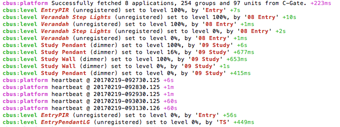

# C-Bus for Homebridge

[](https://travis-ci.org/simonhac/homebridge-cbus)  [](https://coveralls.io/github/simonhac/homebridge-cbus?branch=master)

HomeKit-enable your C-Bus installation with the `homebridge-cbus` plugin for the [Homebridge](https://github.com/nfarina/homebridge) server.

`homebridge-cbus` provides a bridge between [Clipsal's C-Bus](http://www2.clipsal.com/cis/technical/product_groups/cbus) [C-Gate](http://www2.clipsal.com/cis/technical/downloads/c-gate) server and Apple's [HomeKit](http://www.apple.com/au/ios/home/).

Once setup, a homebridge server with the `homebridge-cbus` plugin will allow you to instantly monitor and control all of your supported C-Bus accessories.

What does that mean? You'll be able to control your home with:

* Siri voice commands
* the built-in iOS 10+ Home app
* iOS apps that support HomeKit.

## In Action
To see some action of HomeKit controlling a Clipsal C-Bus system, check out the following videos:

* https://www.youtube.com/watch?v=1_pzVlegnio
* https://www.youtube.com/watch?v=0NT9AGQd_FU

## Device Support

This project provides a bridge which 'exposes' your devices in a way that you can control then using HomeKit. `homebrige-cbus` is currently able to control and/or monitor:

* lights
* switches (with optional timeout)
* dimmers
* shutter relays
* fans
* motion sensors
* security presence detectors
* trigger events
* contact sensors
* temperature sensors

If you need support for a new device type, feel free to open an issue, or have a go cutting code yourself. If you have some familiarity with [Node.js](https://nodejs.org/) you'll find it pretty straightforward.

## Installation

After installing and setting up [Homebridge](https://github.com/nfarina/homebridge), you can install the `homebridge-cbus` plugin with:

    npm install -g homebridge-cbus

Once installed, update your Homebridge's `config.json`.

N.B. you will need a C-Bus [C-Gate server](http://www2.clipsal.com/cis/technical/downloads/c-gate) on your network. This is a cross platform Java application which runs on most platforms. 

## Configuration

As with other Homebridge plugins, you configure the `homebridge-cbus` plugin by adding it to your `config.json`.

```json
  "platforms": [
    {
      "platform": "homebridge-cbus.CBus",
      "name": "CBus",
      "client_ip_address": "127.0.0.1",
      "client_controlport": 20023,
      "client_cbusname": "HOME",
      "client_network": 254,
      "client_application": 56,
      "client_debug": true,
      
      "platform_export": "my-platform.json",
      
      "accessories": [ ... ]
     }
]
```

N.B. If you are connecting to a remote C-Gate server, you will likely need to configure C-Gate for remote connections by adding an interface entry to the file `cgate/config/access.txt`.


### Configuration platform fields
* `platform` and `name`: platform and name – you may leave these values
* `client_ip_address`: (required) IP address of your C-Gate server
* `client_controlport`: (optional, defaults to 20023) port number of the C-Gate control port
* `client_cbusname`: (required) project name of your C-Bus network
* `client_network`: (optional, defaults to 254) default network address for your C-Bus devices
* `client_application`: (optional, defaults to 56) default application address for your C-Bus devices
* `client_debug`: (optional, defaults to `false`) set to `true` to write C-Bus client debug logs to the console
* `accessories`: (required) list of accessories to expose to the Homebridge server
* `platform_export`: (optional) path to file for exporting a unified accessory list, see below.

(NB. `client_eventport` and `client_statusport` are no longer required, and will be safely ignored)


### Registering accessories
You must register devices by hand in a config file, however to make this easier for you, `homebridge-cbus` can automatically build most of the file for you. See Unified Accessory List, below.

The platform definition in the `config.json` file contains an `accessories` array, which defines the available accessories using the following keys:

* `type`: (required) type of the accessory. The valid values are "light", "switch", "dimmer", "shutter", "motion", "security", "trigger" and "contact".
* `name`: (required) name of the accessory (e.g. "Living Room Light", "Bedroom Light", "Living Room Curtain" etc.)
* `network`: (optional, defaults to `client_network`) C-Bus network address of the device
* `application`: (optional, defaults to `client_application`) The C-Bus Application address of the device
* `id`: (required) C-Bus address of the device — every accessory in C-Bus has one
* `invert`: (optional, defaults to false) only used by the shutter relay accessory and indicates that the shutter has been wired to open when commanded closed and vice versa
* `activeDuration`: (optional) only used by the switch accessory, indicating a timeout period, after which the switch will automatically switch off. This allows a HomeKit switch accessory to be used to generate a *Bell Press* event.
* `rampDuration`: (optional, maximum 17 minutes) only used by the dimmer accessory, indicating the ramp up/down time when dimming.
* `enabled`: (optional, default: true) set to false to inhibit the accessory from loading.
* `action`: (required by the trigger accessory) sets the action selector to be triggered. 

(NB. Durations can be specified in days, hours, minutes, seconds or milliseconds. (eg.: "2 days", "2.5h", "5s", "100 ms", etc. ) For more information on allowable formats, please see the [ms library](https://github.com/zeit/ms))

### Functional example `config.json`
````json
{
  "bridge": {
    "name": "My Home",
    "username": "CC:22:3D:E3:CE:30",
    "port": 51826,
    "pin": "031-45-154"
  },
  
  "description": "My home HomeKit API configuration file",

  "platforms": [
    {
      "platform": "homebridge-cbus.CBus",
      "name": "CBus",
      "client_ip_address": "127.0.0.1",
      "client_controlport": 20023,
      "client_cbusname": "WEBB",
      "client_network": 254,
      "client_application": 56,
      "client_debug": true,

      "platform_export": "my-platform.json",
            
      "accessories": [
        { "type": "light", "id": 0, "name": "Flood" },
        { "type": "light", "id": 1, "name": "Main Bay" },
        { "type": "light", "id": 2, "name": "3rd Bay" },
        { "type": "light", "network": "250", "id": 1, "name": "Outside Light" },
        { "type": "light", "network": "250", "application": "203", "id": 3, "name": "Backdoor" },
			
        { "type": "dimmer", "id": 3, "name": "Closet" },
        
        { "type": "dimmer", "id": 22, "name": "Wake Up Lights", "rampDuration": "10 min"},		
       	    
        { "type": "shutter", "id": 145, "name": "Living Blinds" },
        { "type": "shutter", "id": 142, "name": "Dining Blinds", "invert": "true"},
        
        { "type": "fan", "id": 7, "name": "Kitchen Fan"},
				
        { "type": "motion", "id": 51, "name": "Main" },
			    
        { "type": "security", "application": 208, "id": 1, "name": "Entry Zone" },
			    
        { "type": "switch", "id": "9", "name": "Garden Lights", "activeDuration": "2.5 hrs" },
        
        { "type": "trigger", "application": 202, "id": 0, "action": 1, "name": "recall preset 2" },

        { "type": "temperature", "id": 245, "application": 228, "channel": 1, "name": "Living Room Temperature" },
	
	{ "type": "contact","id": 5, "name": "Bedroom Window" }
      ]
    }
  ],
  "accessories": [ ]
}
````

## Unified Accessory List

If the `platform_export` property is set to a valid pathname, upon startup `homebridge-cbus` will export a suggested accessory list. The list will include all groups found in your C-Gate database. By default found groups are disabled, unless they are already defined as enabled in your current `config.json` file.

It is suggested that you check this file after your first successful run of `homebridge` with this plug-in loaded. You'll then be able to open the generated file and copy the entries of interest into your `config.json` file.


## Logging
`homebridge-cbus` has four logging channels:

* `cbus:platform`: highest level startup/shutdown and fatal error reporting (enabled by default)
* `cbus:level`: all level change events reported by C-Gate
* `cbus:client`: all communication with C-Gate
* `cbus:db`: significant events reported by the database syncing module

On startup, the status of the channels will be determined from the environment variable DEBUG. eg.:

````
# all C-Bus logging
> DEBUG=cbus:* homebridge
 
# just level change events
> DEBUG=cbus:level homebridge

# very verbose logging from all of homebridge
> DEBUG=* homebridge 
````

N.B. If provided, the `client_debug` setting (from `config.json`)  will override the configuration for `cbus:client` from the environment.

### Example logging output



## Unit testing
homebridge-cbus uses the excellent [tape unit-testing framework](https://github.com/substack/tape).

To run tests:

````
npm test
````

To run tests and generate code coverage reports:

````
npm run test-coverage
````

## Changes Since 0.5.0
* 0.6.5: adds support for `contact` accessory

* 0.6.4: adds support for `trigger` accessory

* 0.6.3: Bugfix

* 0.6.2: Bugfix

* 0.6.1: 
  - when building the Unified Accessory List, use the unitType of the C-Bus units controlled by the group to make a semi-intelligent guess of the accessory's type.
  - improved support for C-Bus installations with multiple networks
   
* 0.6.0: relax tests for project name validity

* 0.5.9: adds support for `rampDuration` (for dimmers) and remove extraneous C-Bus comms when dimming or changing fan speed 

* 0.5.8: adds support for `fan` accessories 

* 0.5.7: 
  * adds support for `switch` accessories including optional `activeDuration` property
  * adds Unified Accessory List export
  * adds support for `enabled` property on accessories

* 0.5.6: fetch and cache a copy of the C-Gate database for improved logging
* 0.5.5: introduces unit testing and more robust configuration file checking
* 0.5.4: fixes issue where some required files were missing
* 0.5.3: adds support for `shutter` accessory
* 0.5.2: adds support for `security` accessory, for PIR presence detectors, typically on application 208
* 0.5.1: adds optional `network` and `application` parameters per accessory, allowing accessories to be monitored or controlled across multiple networks and applications.

N.B. If you are upgrading from an ealier version of `homebridge-cbus`, you may need to remove the files in your `~/.homebridge/persist/` directory before running for the first time due to new device UUIDs.

## Contributions
* fork
* create a feature branch
* open a Pull Request

Contributions are surely welcome!
